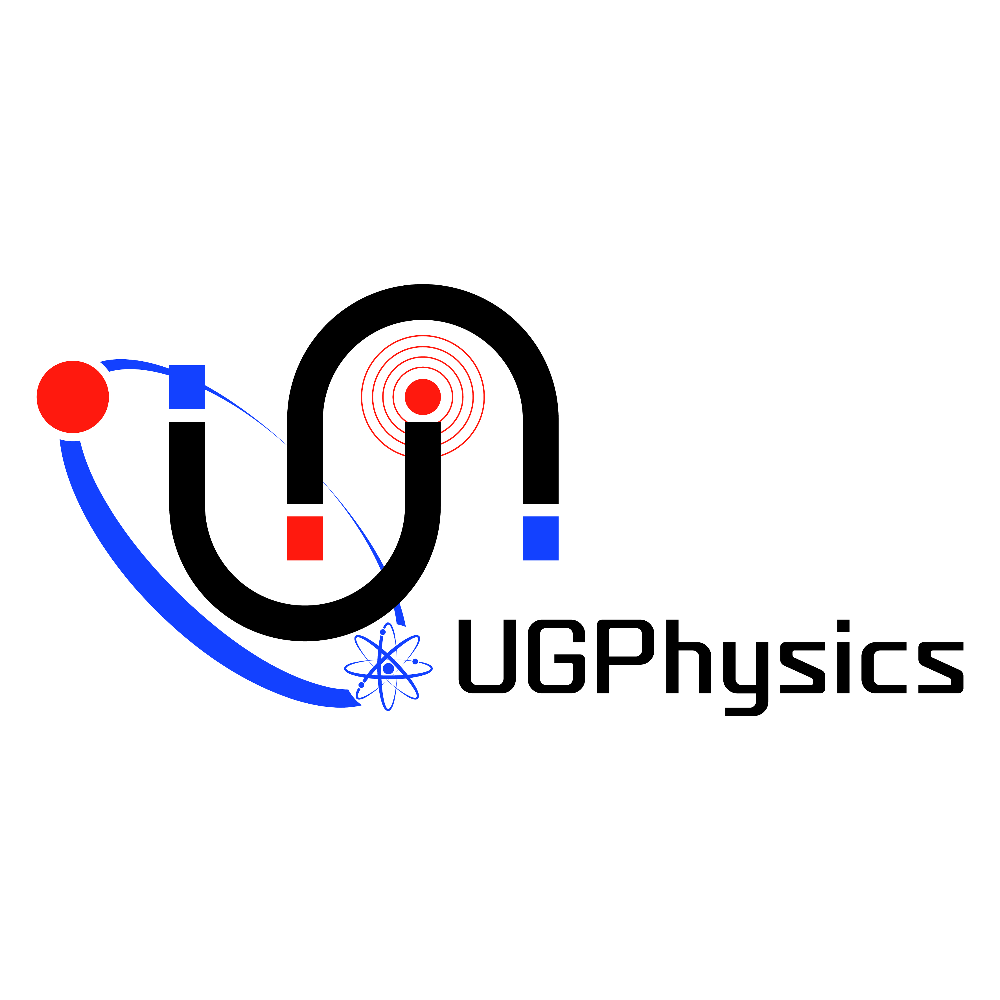
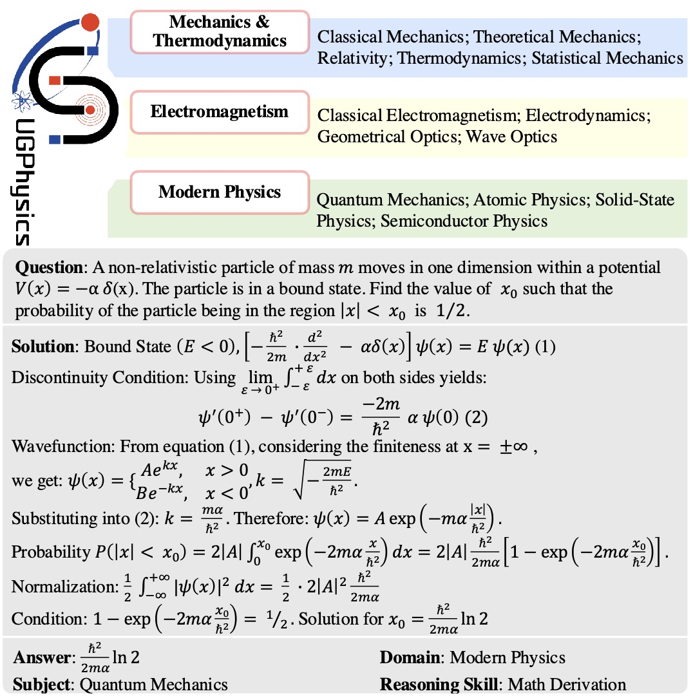

<h1 align="center">
     <br>UGPhysics
</h1>
<p align="center">
    <a href="https://arxiv.org/abs/2502.00334">
        
    </a>
    <a href="https://huggingface.co/datasets/UGPhysics/ugphysics">
        
    </a>
</p>

## 🔥News

- *2025-02-01*: We have released the UGPhysics dataset and Our Paper on Arxiv.

------


*UGPhysics is a large-scale and comprehensive benchmark tailored for evaluating the physics problem-solving abilities of LLMs across multiple UnderGraduate-level Physics (UGPhysics) disciplines, comprising 5,520 distinct problems in three main domains, 13 core subjects, and 59 key topics.*



## 🏆 Leaderboard
coming soon!

## 🫵🏻 Test your own model

#### Download Data
```bash
git clone https://huggingface.co/datasets/UGPhysics/ugphysics
mv ugphysics/* ./data/
```

#### Export Your Key
```bash
export OPENAI_BASE_URL=your_base_url
export OPENAI_API_KEY=your_key
```

#### Inference

For closed-source LLMs, please replace `${MODEL}` and `${SUBJECT}` by the LLM and subject you want to test.
```bash
python codes/infer_close.py --model ${MODEL} --subject ${SUBJECT}
```

For open-source LLMs, we will use `vllm` to accelerate inference.

```bash
python codes/generate_open.py --model ${MODEL} --system ${SYS_PROMPT} --subject ${SUBJECT} --tensor_parallel_size 8
```
where `SYS_PROMPT` is the system prompt, e.g., "Please reason step by step, and put your final answer within \\boxed{}.".


#### Evaluate
Remember to export your keys as mentioned above. 
```bash
python codes/eval.py --model_path ${MODEL} --subject ${SUBJECT} 
```

## 💬 Citation
Thanks for the open source code of [OlympiadBench](https://github.com/OpenBMB/OlympiadBench) and [OlympicArena](https://github.com/GAIR-NLP/OlympicArena).
Our `README.md` is adapted from [OmniMath](https://github.com/KbsdJames/Omni-MATH).

If you find our work interesting and meaningful, welcome to give a 🌟 to our repo and cite our paper.
```
@article{xu2025ugphysics,
  title={UGPhysics: A Comprehensive Benchmark for Undergraduate Physics Reasoning with Large Language Models},
  author={Xu, Xin and Xu, Qiyun and Xiao, Tong and Chen, Tianhao and Yan, Yuchen and Zhang, Jiaxin and Diao, Shizhe and Yang, Can and Wang, Yang},
  journal={arXiv preprint arXiv:2502.00334},
  year={2025}
}
```
